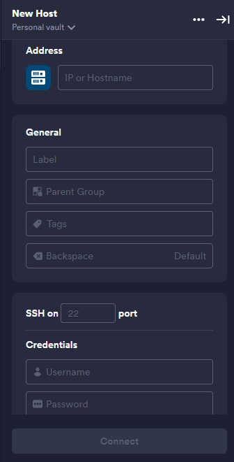
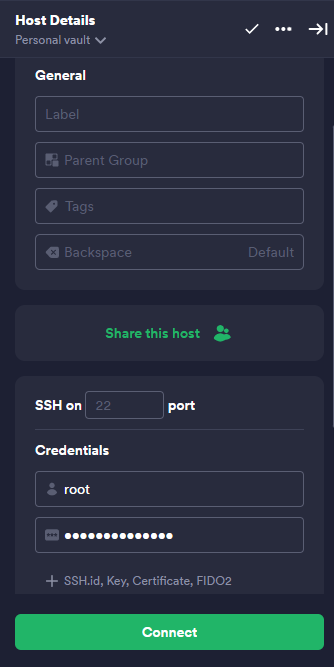
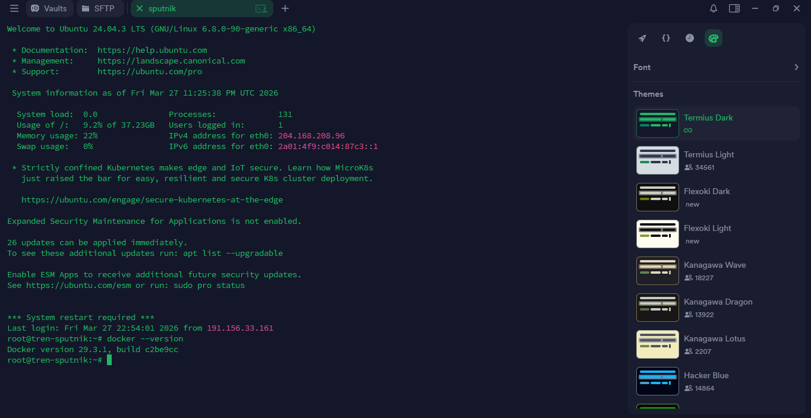

# Instalación de Docker usando Termius

---

## 1. Configuración inicial del Host en Termius

### 1.1 Acceso a la sección de Hosts

Abrir la aplicación **Termius** y dirigirse a la sección Hosts, donde se administran las conexiones a servidores remotos.


### 1.2 Creación de un nuevo Host

Dentro de la sección **Hosts**, seleccionar la opción **"NEW HOST"**.
Al hacerlo, se desplegará un panel de configuración en el lado derecho de la pantalla.


### 1.3 Configuración de los datos del Host

Completar los campos requeridos con la información del servidor:
    1. **Address:** Ingresar la dirección IP del servidor.
    2. **Label:** Asignar un nombre descriptivo para identificar el Host (puede ser cualquiera).
    3. **Credentials:**
       * **Username:** ``root``
       * **Password:** Contraseña del servidor



### 1.4 Conexión al servidor

Una vez completados los datos, hacer clic en el botón **"Connect"** para establecer la conexión con el servidor.



---

## 2. Instalación de Docker en el servidor

### 2.1 Acceso a la terminal del servidor

Una vez establecida la conexión, se abrirá la **terminal del servidor (sesión SSH)**, desde la cual se ejecutarán todos los comandos necesarios para la instalación.



### 2.2 Actualización de paquetes del sistema

Antes de instalar Docker, es recomendable actualizar los paquetes del sistema para evitar conflictos:

```
apt update && apt upgrade -y
```
### 2.3 Instalación de Docker

Ejecutar el siguiente comando para instalar Docker:

```
apt install docker.io -y
```
### 2.4 Verificación de la instalación

Una vez finalizada la instalación, verificar que Docker se haya instalado correctamente:

```
docker --version
```

Si el comando devuelve una versión, significa que Docker está instalado correctamente.

### 2.5 ejecutar el servicio de Docker

Para asegurarse de que Docker esté funcionando:

```
docker ps
```

1. Conclusión

Con estos pasos, Docker queda instalado y en ejecución en el servidor, listo para desplegar contenedores.

Esta configuración servirá como base para la instalación de servicios adicionales como:
    * MySQL
    * PostgreSQL

los cuales se ejecutarán posteriormente mediante contenedores Docker para garantizar portabilidad, aislamiento y facilidad de despliegue.

